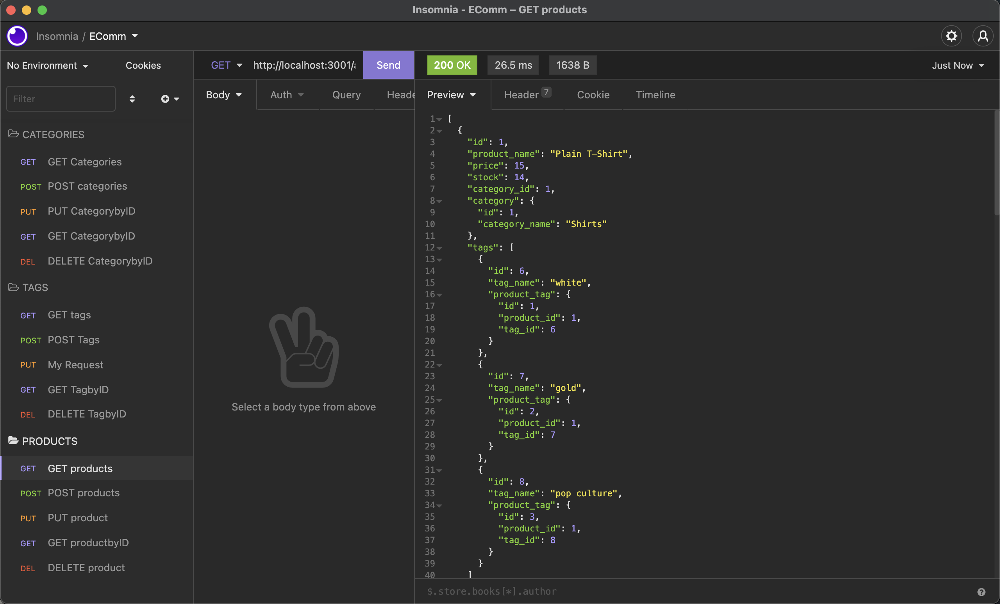
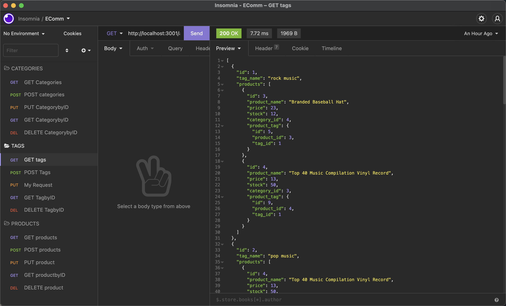
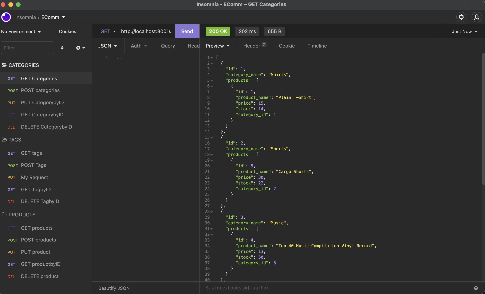

  # EComm
  
  )
  
  ## Description
  This application serves as the back-end for an E-commerce site which utilizes Express.js as the server and MySQL as the database.
  
[Deployed application](https://github.com/JessVarghese/EComm)

  ## Table of Contents

  * [Installation](#Installation)
  * [Usage](#Usage)
  * [Technologies](#Technologies)
  * [Visuals](#usage)
  * [License](#license)
  * [Questions](#questions)
 

  ## Installation
  * Both Node.js and MySQL must be installed prior to executing the application.
  * gh repo clone JessVarghese/EComm
    * You’ll need to use the MySQL2 and Sequelize (Links to an external site.) packages to connect your Express.js API to a MySQL database and the dotenv package to use environment variables to store sensitive data, like your MySQL username, password, and database name. Use the schema.sql file in the db folder to create your database using MySQL shell commands. Use environment variables to store sensitive data, like your MySQL username, password, and database name.
  
  ## Usage
  This application utilizes Insomnia to view and update the database. Please reference the video demo below.

  [VIDEO DEMO](https://watch.screencastify.com/v/hGOA2brjR1tJIzrSN9C3)
 
  ## Technologies
  * Express.js
  * Node.js
  * Sequelize
  * MySQL
  * Dotenv
  * Insomnia
  
  ## Visuals
 
 
 

  ## License
  This project operates under the [MIT](https://choosealicense.com/licenses/MIT/) license.

  ## Questions
  If you have any questions about the repo, open and issue or contact me directly:
  * Email: jessvarghese@gmail.com
  * Github: https://github.com/JessVarghese

